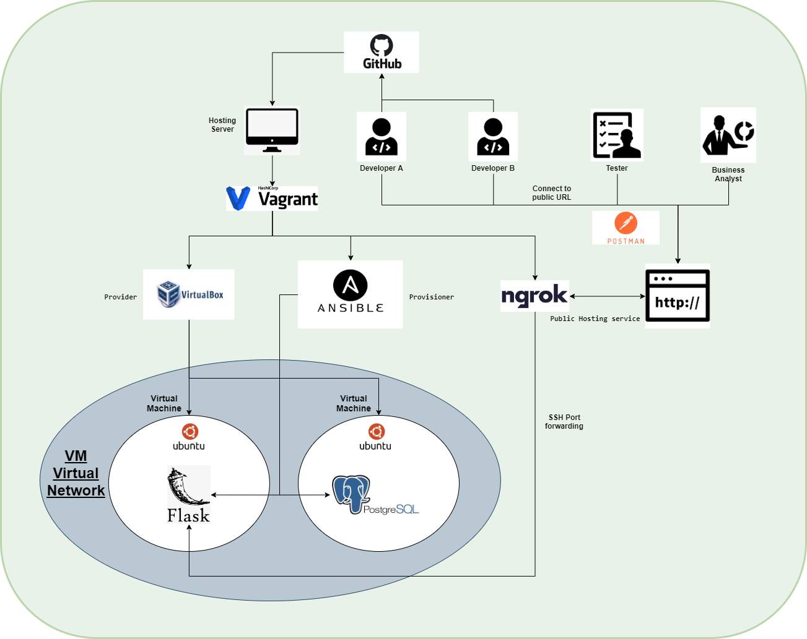
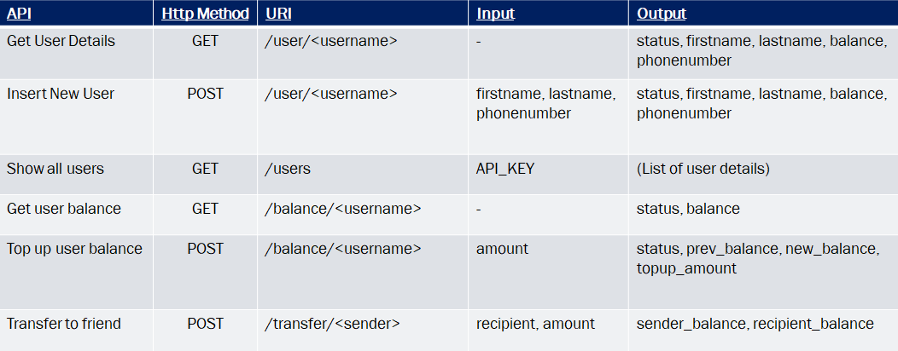
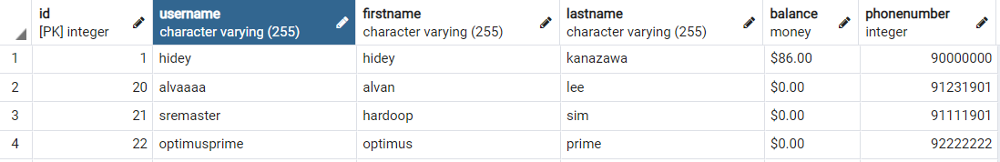

# Using Vagrant and Ansible to provision a two-tier Flask API

## Technology Stack
Ubuntu | Vagrant | Ansible | Python | PostgreSQL | ngrok
:-------------------------:|:-------------------------:|:-------------------------:|:-------------------------:|:-------------------------:|:-------------------------:
  |    |  |  |  | 

<br>

---

## Motivation
Inspiration behind this project was fueled by two main areas; first is the desire to provide a simple workflow which enables developers, business analysts & testers to run their API calls against the same pre-alpha/alpha flask API server and be aligned with their UAT (User Acceptance Testing) standards. The other area that motivated this project was to build familiarity with provisioning software (Vagrant/Oracle VM Box) and configuration management tools (Ansible).

The project entails automating provisioning of a FlaskAPI service with a PostgreSQL database through a simple CLI command: `vagrant up`.
 of Virtual Machines using `Oracle VirtualBox` with a base Ubuntu Xenial image. `Ansible` will proceed to set-up and configure `FlaskAPI` on one VM (front-end) and `PostgreSQL` DB on the other. The flaskAPI endpoint would then be exposed to the public using the `ngrok` public hosting service through `vagrant share` command. 

One way to improve the workflow would be to introduce a CI/CD pipeline with robust test cases. Connecting the Github webhook with Jenkins or CircleCI, we could take one step further and automate build, testing and deployment upon any repository push by the developer team. 

<br>

---

## Architecture diagram


<br>

---

## Python Flask API (Port:5000)

In summary, these are the methods available on the Flask API - 



The API was written initally with the default routing ```@app.get('/')``` convention. After finding out it doesn't fulfill RESTful best practices, the ```Flask RESTful``` python library was used and the codebase was refactored to include GET/POST methods within functions instead of routing. 

You may find more details from my [RESTful Flask API] github repository

<br><br>

---

## PostgreSQL Database (Port: 5432)
There will be one users table in our PostgreSQL database storing details and account balance for our loyal user base. The fields available in our schema is shown below:



You may find more details from my [RESTful Flask API] github repository.


[RESTful Flask API]: https://github.com/hideyukikanazawa/restful-flask-api